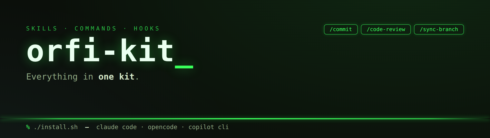

# orfi-kit

A generic, reusable bundle of **Claude Code + GitHub Copilot CLI** skills, commands, and hooks for
AI-augmented development. It packages a team's day-to-day automation — git conventions, guardrails,
commits, code review, session state, test runners, Jira estimation, C# XML-doc and C++ Doxygen-doc
rules, and branch sync — and installs them flat (every item is prefixed `orfi-kit-`).

> **Related kit:** `orfi-ae-kit` (the Architect/Executor pattern) is a **separate** repo that lists
> orfi-kit as a prerequisite. This repo is only orfi-kit.

## What's inside

Every row below links to a full doc page under [`docs/skills/`](docs/skills/).

### Skills (always-on, auto-triggered, or invoked)

Claude Code / OpenCode skills (Copilot ships these as slash commands). Most trigger on their own; the
two code-review skills (`orfi-kit-csharp-code-review`, `orfi-kit-cpp-code-review`) are skill
directories because each ships a companion `CONFIG.md`, but you invoke them like commands.

| Capability | What it does | Trigger | Requires |
| --- | --- | --- | --- |
| [orfi-kit-guardrails](docs/skills/orfi-kit-guardrails.md) | Always-on behavioral constraints enforcing honesty, real test verification, safe version control, and clear communication. | Always active (not user-invocable) | — |
| [orfi-kit-git-conventions](docs/skills/orfi-kit-git-conventions.md) | Required commit / branch / PR formats (typed verbs, optional ticket IDs) plus the epic/story branching + master→epic→feature sync workflow. | Auto-triggers on any git commit / branch / PR operation | A ticket ID when one exists; for epic work: an `origin` remote and `epic/*` + `feature/*` branches |
| [orfi-kit-scrum-poker](docs/skills/orfi-kit-scrum-poker.md) | Estimates a Jira ticket on the Fibonacci scale (1/2/3/5/8/?) with calibration and reasoning, then writes the points back after you confirm. | Auto-triggers when you ask to estimate / size a Jira ticket | Atlassian MCP server with access to your Jira instance |
| [orfi-kit-xml-docs](docs/skills/orfi-kit-xml-docs.md) | Enforces formal `///` XML doc comments on every public, protected, and static C# member. | Auto-triggers when writing / editing C# XML doc comments | A C# project; `pwsh` for the checker |
| [orfi-kit-doxygen-docs](docs/skills/orfi-kit-doxygen-docs.md) | Enforces Doxygen comments on every exposed (public / protected / static) declaration in C++ headers; follows the file's existing `/**` or `///` style. | Auto-triggers when writing / editing C++ Doxygen comments | A C++ project; `pwsh` or bash for the checker |
| [orfi-kit-csharp-code-review](docs/skills/orfi-kit-csharp-code-review.md) | C# review that **runs** the enforcers (`dotnet format --verify-no-changes`, `build`, `test`) and grounds every style verdict in the repo's own `.editorconfig` / `Directory.Build.props` rather than general C# norms, then judges correctness, completeness, and ADR/PRD conformance. Ships a `CONFIG.md` baseline for repos with no config. | `/orfi-kit-csharp-code-review [DIFF\|FULL\|<path>]` — diff-scoped by default | A C# project and the .NET SDK; an upstream branch for diff scope |
| [orfi-kit-cpp-code-review](docs/skills/orfi-kit-cpp-code-review.md) | C++ sibling of the above: **runs** `clang-format --dry-run`, `clang-tidy`, the project's build and tests, and grounds style verdicts in the repo's own `.clang-format` / `.clang-tidy` — or, when those are absent (the common case in C++), in the prevailing pattern of the file being changed. Adds memory/lifetime, const-correctness, and header-hygiene judgment; skips vendored and generated code. Ships a `CONFIG.md` baseline. | `/orfi-kit-cpp-code-review [DIFF\|FULL\|RAW\|SMART\|<path>]` — diff-scoped by default; ownership style (raw vs smart pointers) is resolved per project from config, conventions, or by asking | A C++ project; `clang-format` / `clang-tidy` + a compilation database for the tool lane (degrades without them) |

### Commands (you invoke them)

Claude Code / OpenCode commands — also available as Copilot slash commands.

| Capability | What it does | Invoke | Requires |
| --- | --- | --- | --- |
| [orfi-kit-commit](docs/skills/orfi-kit-commit.md) | Commit current changes with messages auto-formatted to orfi-kit's git conventions. | `/orfi-kit-commit` | A ticket ID if one applies (you're prompted; omitted if none) |
| [orfi-kit-code-review](docs/skills/orfi-kit-code-review.md) | Read-only, file-by-file review of the codebase, optionally scoped to BUGS / SECURITY / PERFORMANCE. | `/orfi-kit-code-review` | — |
| [orfi-kit-standup](docs/skills/orfi-kit-standup.md) | Builds a Teams-ready status/standup report (In progress / Done / Next / Blockers) through guided questions, fetching Jira titles for any ticket you name, then iterates until you confirm. | `/orfi-kit-standup` | Atlassian MCP server only if you want ticket titles fetched automatically (else you're prompted) |
| [orfi-kit-enforce-guardrails](docs/skills/orfi-kit-enforce-guardrails.md) | Re-asserts all operational guardrails to snap behavior back into compliance when it drifts. | `/orfi-kit-enforce-guardrails` | — |
| [orfi-kit-set-helper-files-root](docs/skills/orfi-kit-set-helper-files-root.md) | Configures (creates or changes) the per-repo helper-files root the state files live under, recorded in an untracked `.orfi-kits/helper-files-root` pointer. | `/orfi-kit-set-helper-files-root` | A path to your helper-files root (prompted if omitted) |
| [orfi-kit-init](docs/skills/orfi-kit-init.md) | Bootstraps the kit files (session-state + onboarding placeholders) under `<root>\orfi-kits\` — create-if-absent, never overwrites; quits if already initialized. | `/orfi-kit-init` | The helper-files root (configured on the spot if unset) |
| [orfi-kit-cleanup-state](docs/skills/orfi-kit-cleanup-state.md) | Strips internal scaffolding (`.orfi-kits/`, `.planning/`, `.trackbed/`, `docs/superpowers/`) before the final epic PR merge — backs up to `helper_files/stripped/` first, then `git rm`. Destructive; `☠️` confirmation prompt. | `/orfi-kit-cleanup-state` | Run on the branch being finalized |
| [orfi-kit-load-state](docs/skills/orfi-kit-load-state.md) | Restores a prior session by reading its `CLAUDE-SESSION-STATE.md` handoff before any other work. | `/orfi-kit-load-state` | The helper-files root configured (see above); a `CLAUDE-SESSION-STATE.md` written by a prior session |
| [orfi-kit-persist-state](docs/skills/orfi-kit-persist-state.md) | Writes a session handoff file so you can clear context and resume work later. | `/orfi-kit-persist-state` | The helper-files root configured (see above) |
| [orfi-kit-run-unit-tests-phase](docs/skills/orfi-kit-run-unit-tests-phase.md) | Runs unit tests for one GSD phase (or all), logging parsed pass/fail/skip summaries. | `/orfi-kit-run-unit-tests-phase` | A .NET project using `dotnet test` |
| [orfi-kit-run-integration-tests-phase](docs/skills/orfi-kit-run-integration-tests-phase.md) | Runs integration tests for one GSD phase (or all), logging parsed pass/fail/skip summaries. | `/orfi-kit-run-integration-tests-phase` | A .NET project; repo root for a `.tests/` dir |
| [orfi-kit-run-codegraph-phase](docs/skills/orfi-kit-run-codegraph-phase.md) | Runs codegraph for a single GSD phase, identified by a phase-number argument. | `/orfi-kit-run-codegraph-phase` | — |
| [orfi-kit-sync-branch](docs/skills/orfi-kit-sync-branch.md) | Syncs an epic-derived working branch (any prefix) through `origin/master → epic/* → working branch` before push, auto-detecting merge vs rebase. | `/orfi-kit-sync-branch` | An epic-derived working branch (any prefix, not `master`/`epic/*`); `origin` remote; `epic/*` naming |
| [orfi-kit-sync-master](docs/skills/orfi-kit-sync-master.md) | Rebases the current branch on `origin/master`, resolves conflicts, and force-pushes with `--force-with-lease` for linear history. Aborts on `master`/`epic/*` and steers epic-derived branches to `/orfi-kit-sync-branch`. | `/orfi-kit-sync-master` | A standalone branch (no epic parent); an `origin/master`; a remote tracking branch |

### Hook & extension (passive)

| Capability | What it does | Surface | Requires |
| --- | --- | --- | --- |
| [orfi-kit-enforce-sync-hook](docs/skills/orfi-kit-enforce-sync-hook.md) | PreToolUse/Bash hook that **blocks `git push`** from an epic-derived working branch (any prefix) until it's rebased on its parent `epic/*`; ignores `master`/`epic/*`. Pairs with `orfi-kit-sync-branch`. | Claude Code hook | An epic-derived working branch; `origin` remote; at least one `origin/epic/*` branch (else push is allowed) |
| [orfi-kit-enforce-brevity-hook](docs/skills/orfi-kit-enforce-brevity-hook.md) | Stop hook that **blocks over-long replies**: counts lines in the assistant's finished reply and, if over ~25 (about one page), feeds it back with an instruction to shorten. Lifts the limit when the user asks for depth (e.g. "in full", "in detail"). Enforces the guardrails' brevity rule mechanically. | Claude Code hook | `jq`; a Stop-hook-capable Claude Code. Copilot gets a next-turn equivalent via the guardrails extension |
| [orfi-kit-guardrails-extension](docs/skills/orfi-kit-guardrails-extension.md) | Copilot SDK session extension that injects the guardrails as always-active context, **plus** an `onUserPromptSubmitted` brevity check that nudges when the previous reply ran long. Installs to `~/.copilot/extensions/orfi-kit-guardrails/`. | Copilot CLI extension | The `@github/copilot-sdk` package; Copilot CLI |

## Install

The repo ships two equivalent installers (a maintenance pair). Run either and pick which
runtime(s) you want (Claude Code, OpenCode, GitHub Copilot CLI — one or several).

**bash:**

    ./install.sh              # interactive install
    ./install.sh --link       # symlink instead of copy (dev: repo edits go live)
    ./install.sh --uninstall  # remove an existing install
    ./install.sh --help       # usage

**PowerShell (pwsh on Windows / macOS / Linux):**

    ./install.ps1             # interactive install
    ./install.ps1 -Link       # symlink instead of copy
    ./install.ps1 -Uninstall  # remove an existing install
    ./install.ps1 -Help       # usage

### Hook wiring (Claude Code)

When you install for Claude Code, the installer places two hooks in `~/.claude/hooks/` and wires
each into `~/.claude/settings.json`:

- `orfi-kit-enforce-sync.sh` → a **PreToolUse/Bash** entry (blocks unsynced `git push`).
- `orfi-kit-enforce-brevity.sh` → a **Stop** entry (blocks over-long replies; ~25-line limit,
  override with `ORFI_BREVITY_MAX_LINES`, auto-lifted when the user asks for depth).

Both merges are **idempotent** and **non-destructive**: your existing settings are preserved and a
`settings.json.bak` backup is written before any change. Decline the sync-hook prompt to get manual
wiring instructions instead. Uninstall removes both hook files and their settings entries.

> Auto-wiring requires `jq` (bash) — without it you'll get manual instructions. PowerShell uses
> built-in JSON support.

### Copilot extension

When you install for GitHub Copilot CLI, the guardrails extension is copied to
`~/.copilot/extensions/orfi-kit-guardrails/` (the path the Copilot CLI loads user extensions from).

## Uninstall

Run the same installer with `--uninstall` (bash) or `-Uninstall` (PowerShell) and select the same
runtime(s). Skills, commands, the hook + its settings entry, and the Copilot extension are removed.

## License

MIT — see `LICENSE`.
